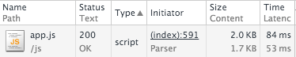

#Opdrachten Week 3
######Minor Web Development - Performance Matters - Linda van Dijk
[Link naar server op Digital Ocean](https://looklive.lindavandijkdesign.nl/)

## Opdracht 1. Onderzoek naar taskmanagers

##### Taskmanagers

Ik ga Gulp gebruiken omdat

* Gulp geeft meer flexibiliteit dan Grunt
* Gulp is veel sneller met betrekking tot perfomance gerelateerde dingen dan Grunt
* Waar Grunt configuratie nodig heeft, kan Gulp meerdere taken tegelijk uitvoeren
* Net als Grunt gebruikt Gulp ook Node, maar je hoeft niet exact te weten hoe Node werkt. Het is erg simpel om Gulp te gebruiken

Bronnen

* [http://andy-carter.com/blog/a-beginners-guide-to-the-task-runner-gulp](http://andy-carter.com/blog/a-beginners-guide-to-the-task-runner-gulp)
* [https://css-tricks.com/gulp-for-beginners/](https://css-tricks.com/gulp-for-beginners/)
* [https://cdnify.com/blog/top-10-gulp-tasks-for-optimising-front-end-performance/](https://cdnify.com/blog/top-10-gulp-tasks-for-optimising-front-end-performance/)

###Gestest op een 4G netwerk

## Opdracht 2. Optimaliseer HTTP requests

Met behulp van Gulp heb ik de JavaScript minified

Voor:

Na: 

Met behulp van Gulp heb ik ook de CSS minified

Voor:

Na: 

## Opdracht 3. Optimaliseer content images

Met behulp van Gulp heb ik de images 5% geoptimaliseerd

Voor:

Na: 

##Opdracht 4. Optimaliseer web fonts

Met Fontsquirrel heb ik het font gedownload zonder onnodige glyphs

Voor:

Na: 

## Conclusie

Zoals te zien is heeft het wel degelijk zin om scripts minified te maken en images en web fonts te optimaliseren. In dit project is het verschil minimaal, maar bij een groter project zal het verschil ook groter zijn. 

